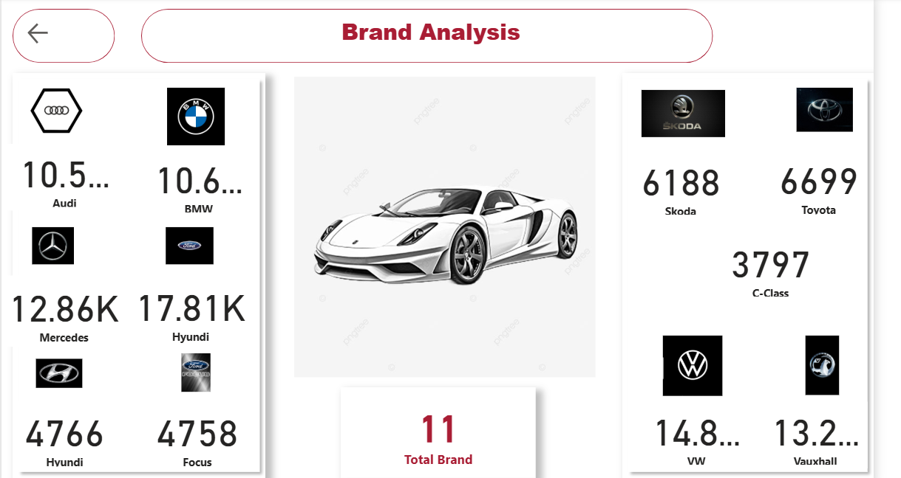
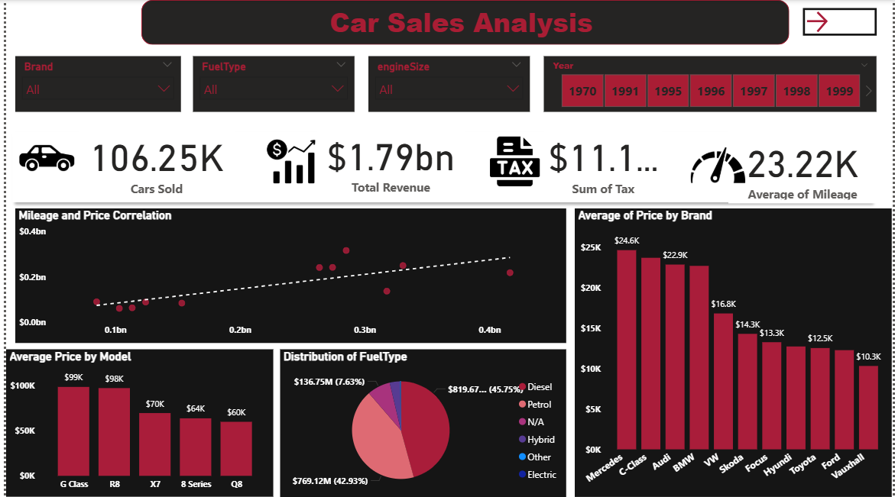

## Used Car sales Insight

## 1. Introduction
This project explores a dataset of over 106,000 used car sales across eleven major car brands in the UK. The aim is to identify patterns, performance trends, and business drivers within the secondhand automobile market. The dataset covers key vehicle attributes such as fuel type, mileage, transmission, engine size, tax, price, model, age, and brand. By analyzing this data, the goal is to generate actionable insights that can inform sales strategy, investment decisions, and operational focus in the used car sector.

## 2. Statement of the Problem
The used car market is vast and dynamic, but decision-making is often hindered by a lack of structured insights into what drives sales, pricing, and revenue. Businesses and investors need clarity on factors that influence profitability—such as brand, vehicle age, fuel type, and transmission type. This analysis seeks to close that gap by revealing the trends that influence revenue and customer behavior in the used car industry.

## 3. Data Source
The dataset was sourced from a comprehensive car sales record, comprising 106,253 transactions across eleven brands.  https://www.kaggle.com/datasets/adityadesai13/used-car-dataset-ford-and-mercedes
 Key variables include:

- Fuel Type

- Mileage

- Transmission Type

- Engine Size

- Miles Per Gallon (MPG)

- Tax

- Price

- Model

- Age

- Brand

## 4. Skills Demonstrated
Throughout this analysis, the following data analytics skills were applied:

Data Cleaning & Transformation: Handling missing values, standardizing formats, and ensuring data consistency.

Exploratory Data Analysis (EDA): Using statistical summaries and visualizations to understand patterns and distributions.

Data Visualization: Creating charts such as scatter plots and bar charts to communicate findings.

Descriptive Analytics: Identifying trends and summarizing key metrics like revenue, price, and tax by category.

Business Intelligence Tools: Leveraging Power BI for interactive dashboards and insights reporting.

## 5. Key Insights

- Total Revenue generated across all sales was approximately $791.73 billion, with total tax amounting to $11.16 million.

- Mercedes-Benz led in revenue generation with an average sale of $24,636.43, followed by C-Class ($23,691.13) and Audi ($22,853.96).

- Fuel type distribution shows Diesel leads with 45.75%, followed by Petrol (42.93%), Hybrid (3.44%), and minor shares from Electric (0.23%) and Other (0.25%).

- The C-Class model had the highest average price of $98,934.20.

- Semi-Auto transmissions generated the most revenue ($577.16 million), followed by Manual ($547.80M) and Automatic ($450.17M).

- 2019 was the peak revenue year, generating $683.35 million in revenue and the highest tax value of $3.67 million.

- The age distribution of cars revealed that vehicles within 7 years generated 37.25% of revenue, followed by 6 years (26.99%), 8 years (24.81%), and 9 years (10.68%).

- MPG (Miles Per Gallon) analysis showed that 38% of entries were N/A. However, the top contributors to revenue included 60.1 MPG (19.3%), 65.7 MPG (14.85%), 54.3 MPG (14%), and 47.9 MPG (13.84%).

- The correlation between mileage and price was observed to be dynamic, varying significantly across brands and models, as seen in scatterplot visualizations.

Recommendations

- Target High-Performing Brands and Models: Focus marketing and procurement efforts on high-revenue brands like Mercedes and models like the C-Class.

- Optimize Fuel Type Offerings: Maintain a strong inventory of Diesel and Petrol cars but monitor emerging interest in Hybrid and Electric cars.

- Capitalize on Peak Sales Years: Analyze what drove the 2019 peak and replicate successful strategies from that period.

- Transmission Preferences: Prioritize stocking Semi-Auto and Manual transmission vehicles based on revenue performance.

- Age-Optimized Inventory: Target sourcing and reselling cars within the 6-8 year age range, which generated the majority of revenue.

- Improve Data Completeness: A significant portion of MPG data is missing; improving data quality can enhance future analysis.

## Conclusion

This analysis highlights key revenue drivers in the used car market, offering valuable insights for dealers, marketers, and investors. By leveraging data on car characteristics and sales patterns, stakeholders can make smarter, more strategic decisions in a competitive auto market.

